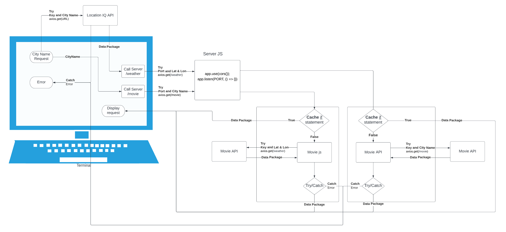

# City Explorer API

**Author**: Francisco
**Version**: 1.0.0 (increment the patch/fix version number if you make more commits past your first submission)

## Overview

One of two Parts for City Explorer. This code base is for the Back-End aspect of City Explorer, an application that allows a user to search a city by name to receive the 16 day weather forecast and any movie with the city name in its title.

## Getting Started

To get this application started in your own machines, you must first get API Keys to [LocationIQ API](https://locationiq.com/), [The Movie Data Base API](https://www.themoviedb.org/documentation/api?language=en-US), and [Weatherbit API](https://www.weatherbit.io/).

Once you have those three API Keys, clone this repository to a local storage. Also clone [City Explorer gitHub](https://github.com/c0d3cisco/city-explorer) locally in a separation folder.

Locally, generate an .env file for the City-Explorer and City-Explorer-API repo. Use the template .env.sample file to populate the correct information. Utilize local port 3001 for the City-Explorer-API repo if possible.

Within the City-Explorer repo in the terminal, run `npm start`. This will initiate your Front-End.

Within the City-Explorer-API repo in the terminal, run `nodemon`. This will initiate your Back-End

Application should be ready to use!

## Architecture

The Axios library is used to retrieve data from the Weatherbit IQ API and TMDB API.

Below is a diagram of the Web Request/Response Cycle flow that makes up this application.

## Credit and Collaborations

[React Bootstrap Elements](https://react-bootstrap.github.io/)
[LocationIQ API](https://locationiq.com/) *used by City Explorer API
[The Movie Data Base API](https://www.themoviedb.org/documentation/api?language=en-US)*used by City Explorer API
[Weatherbit API](https://www.weatherbit.io/)
[Axios Library](https://www.npmjs.com/package/axios#installing)
[Nodemon Library](https://www.npmjs.com/package/nodemon)
